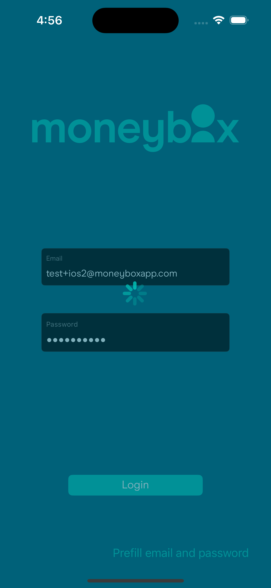

# Moneybox iOS Technical Challenge - Developer notes

## Running the app

The app was built on a MacbookAir (2020) running MacOS 13.5.2 (Ventura) using Xcode 15.0.  It's pure Swift/UIKit.  It's been tested to run on an iPhone 15 Pro simulator with iOS 17.0.  The project file and settings have, as far as possible, been left untouched; the app still targets iOS 13+ but bundle ID and provisioning were changed to allow on-device testing.

For the convenience of the assessor there's an off-spec button at the bottom of the login screen to pre-fill the email/password fields with the provided valid credentials.

Numerous screenshots are provided after this main body of text.

## Architecture and development

The solution is broadly MVVM but borrows somewhat from the Redux/TCA architecture.  I took the decision not to implement a full reducer architecture due to time constraints and the size of the application.  Pragmatism won.  The Model holds the View _state_, and communicates changes in state to the View via an observed (Combine) state property.  The states are, for the most part, simple enums.  I stopped short of including all relevant state data as associated values.  Actions are also not encoded in a typesafe way due to the limited number of them (typically one per screen).  Taking this architectural approach still gives a nice uniform structure to both ViewControllers and Models, and allows for their extension in a predictable way.  It also simplifies testing by moving as much of the logic as possible to the Model.

A simple `NavigationViewController` handles navigation with a back-button override to prevent return to the login screen.

The app is split by screen, with a ViewController and Model for each one, as well as an associated `Error` type.  There are associated table cells for the Account Details screen which hold their own state due to their simplicity.  Each screen is in its own directory.

I moved miscellaneous files into a `Misc` directory to keep the top-level clean.  These include the `Info.plist`, assets, and fonts.  There's a `String` extension for email vaildation in the `Extensions` directory, as well as a convenience one for formatted currency rendering of `Doubles`.  Storyboards were similarly moved into a directory.

Error states are provided to all ViewControllers and error handling is implemented reasonably thoroughly.  To test e.g. the Accounts loading failure state it's necessary to remove the session token prior to the network call in `DataProvider`.

All screens load data asynchronously, where appropriate, with loading indicators.

There appears to be a bug in the simulator implementation of `UITextFieldDelegate`'s `shouldChangeCharactersIn` that causes characters to be deleted.  This does not appear to affect real devices.

Adding money to the Moneybox is reflected in the screen on completion of the request.  The Accounts screen reloads on `willAppear` to ensure it always has up-to-date data.

Files are documented to a level I think appropriate for the scale of the task.  For this simple an app the specification is a good source of truth and the functionality is self-evident.  Files are split with `// MARK: - Section` dividers in a consistent way.  Interesting code has additional comments to try and answer the "why?" questions future developers might have.

The 5 minute lockout on submitting invalid credentials too many times was unexpected, and the project spec would benefit from mentioning this.  I was much more careful testing login failures after that!

Also worth noting that I've not given significant consideration to the session timeout.  This was mainly due to time constraints - waiting for five minutes each time to test code was not deemed a good use of my time! Obviously some form of - possibly preemptive - invisible reauthentication is needed if there's an authentication error; this implies some more central store for known-valid credentials although for this app a simpler mechanism local to the accounts page would suffice.  I've avoided changing the provided Networking package.

I've taken a best-guess at the correct fields in the Accounts API response.  There's a common alphanumeric ID in common between the `ProductResponse`s `Account`s but `ProductResponse` seemed to have all the info I needed.

## External dependencies

Two external package dependencies have been included:

- [`IQKeyboardManagerSwift`](https://github.com/hackiftekhar/IQKeyboardManager) - for keyboard avoidance by TextFields
- [`JVFloatLabeledTextField`](https://github.com/jverdi/JVFloatLabeledTextField) - to float placeholder text above TextFields.

Neither are necessary but both provide a small level of flourish to the UI.

I've also added the Moneybox fonts to the app.  These were sourced from the website as `.woff` files and converted to `.ttf` using an online tool.

An icon was sourced from the PlayStore.  Its size is not ideal but I believe it suffices for the scope of the task.

## Testing

I've added unit tests for both the `LoginViewModel` and `AccountsViewModel`.  Both are similar and demonstrate how the model architecture can be tested asynchronously. I've not provided any UI tests due to the evolving nature of the UI over a short period of time and, in the end, the lack of time to do so.

As suggested a mock was created to load data and ViewControllers inject the provider into their ViewModels.  My preference is for a Service Locator style of DI but in this case simple init-injection works fine.  Again, pragmatism. Tests also follow suit, passing in the mock.  The mock is configurable to load valid and invalid data.

## Accessibility

I made sure that the app runs nicely on both large (Max) and small (SE) form factors.  I've also checked it for dark-mode compatibility, adjusting the table cell dark colour to give a reasonable appearance.  It's been run on a real device (iPhone Xs Max, running iOS 17) without issue.

Improving accessibility was investigated but the defaults Apple provided seemed quite sensible.

## Screenshots

These were taken prior to small additional changes affecting button size, currency precision and minor colour adjustments, as documented in [the commit history](https://github.com/MoneyBox/iOS-Tech-Task/commit/a93c8f8bcf430d3c4d5b8bb1ae04d1b31bdb59c6).

|**Light**||||
|-|-|-|-|
|Home (icon)||||
||||
|Login (empty)|Login (filled)|Login (loading)||
|||||
|Accounts||||
|||||
|Details|Details (adding)|||
|||||

|**Dark**||||
|-|-|-|-|
|Login (empty)|Login (filled)|Login (loading)||
|||||
|Accounts||||
|||||
|Details|Details (adding)|||
|||||
